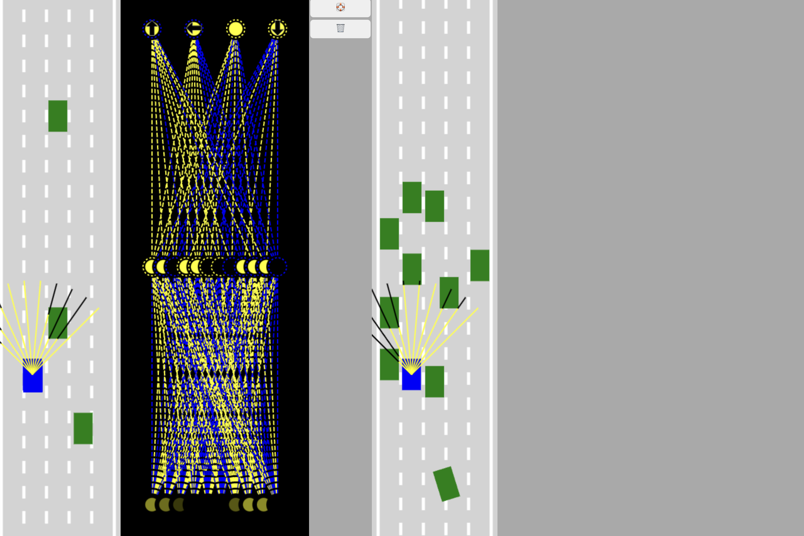

# Self-Driving Car Simulation

Welcome to the Self-Driving Car Simulation project! This project demonstrates a web-based simulation of self-driving cars using JavaScript, HTML5 canvas, and neural networks. Compete with AI-trained cars and experience the future of autonomous driving.



## Features

- **Dual Canvas Setup**: Two canvases display side-by-side for AI and player cars.
- **Real-Time Traffic Simulation**: Dynamic generation of traffic to navigate through.
- **Neural Network Integration**: AI cars are controlled by neural networks, trained and updated in real-time.
- **Player Control**: Control a car using keyboard inputs and compete against AI.
- **Visualization**: Real-time visualization of the neural network's decision-making process.

## Technical Complexities

### Built from Scratch
- **No Libraries**: All code is written from scratch, without using any external libraries.

### Neural Network
- **Integration**: Implemented a neural network to control the AI cars, allowing them to learn and improve over time.
- **Training**: Utilized a mutation algorithm to refine the AI's decision-making process based on past performance.
- **Visualization**: Developed a real-time visualizer to display the neural network's structure and decision-making process.

### Real-Time Simulation
- **Canvas Rendering**: Utilized HTML5 canvas to render the road, cars, and traffic dynamically.
- **Animation Loop**: Created an efficient animation loop to update and redraw the simulation in real-time.
- **Traffic Generation**: Implemented dynamic traffic generation to create realistic and challenging driving conditions.

### User Interaction
- **Player Control**: Developed a control system for the player car, allowing users to navigate using keyboard inputs.
- **Local Storage**: Enabled saving and loading of the best AI brains using local storage, enhancing the training process.

### Code Structure
- **Modularity**: Organized the project into multiple files for better maintainability and readability.
- **Optimization**: Optimized performance to ensure smooth operation even with a large number of cars and complex neural network calculations.

## Installation

1. **Clone the repository**:
   ```sh
   git clone https://github.com/Nimanoro/Self-driving-car.git
   cd Self-driving-car

2- **open index.html**:
   start building your own self driving car and compete with it.


## How It Works

### Canvases

- **AI Canvas**: Displays the AI-controlled cars and their neural network visualization.
- **Player Canvas**: Displays the player-controlled car.

### Main Components

- **Road and Car Initialization**: Roads are set up, and cars are generated for both AI and player control.
- **Traffic Generation**: Creates dynamic traffic for the simulation.
- **Neural Networks**: Each AI car is equipped with a neural network that guides its decisions.
- **Player Control**: The player car can be controlled using the keyboard.

### Key Functions

- `generateCars(n)`: Generates a specified number of AI cars.
- `generateTraffic(n)`: Creates traffic for the AI to navigate.
- `animate(time)`: Updates and redraws the simulation at each frame.

## Usage

- **Train AI**: Let the AI learn and improve by navigating through traffic.
- **Compete**: Use the player car to compete against the AI.

## Future Enhancements

- **Improved AI Training**: Implement more sophisticated training algorithms for the AI.
- **Enhanced UI**: Improve the visual interface and user experience.
- **Additional Features**: Add more interactive features and settings.

## Contributions

Feel free to contribute to this project by forking the repository and creating pull requests. Any suggestions or improvements are welcome!

## License

This project is licensed under the MIT License.


